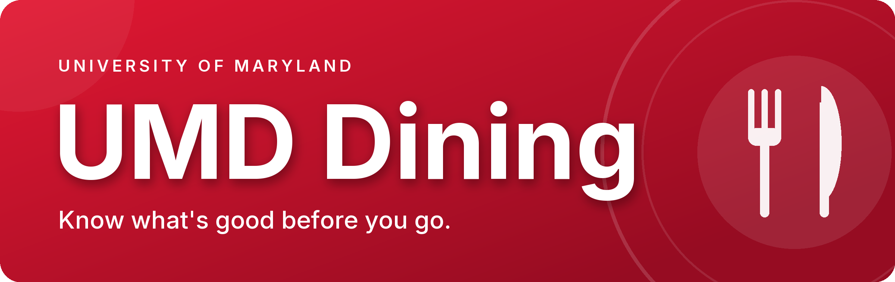

<p align="center">
  
</p>

<p align="center">
  <a href="https://apps.apple.com/us/app/umd-dining/id6761645776">
    
  </a>
</p>

<p align="center">
  <a href="https://api.umddining.com">Website</a> ·
  <a href="https://apps.apple.com/us/app/umd-dining/id6761645776">App Store</a> ·
  <a href="https://forms.gle/53RrYDkmZjmf72Py9">Send feedback</a> ·
  <a href="https://api.umddining.com/privacy">Privacy</a>
</p>

---

**UMD Dining** is a free iPhone app for University of Maryland students. It shows what every dining hall is
serving today, puts the dishes worth walking across campus for at the top, and helps you eat the way you want to —
whether that means avoiding an allergen, hitting a protein goal, or just never missing orange chicken day.

<p align="center">
  
  
  
  
</p>

## What you can do with it

| | |
|---|---|
| 🍽️ **See what's good today** | Menus for Yahentamitsi, 251 North and South Campus Diner, for every meal, up to a week ahead. The feed leads with real dishes — not the salad bar's shredded cheese — and spreads across the stations that have something good. |
| 🎯 **Get a feed that fits you** | Tell the app which cuisines you like and favorite the dishes you love. It learns your taste and surfaces similar dishes, and your favorites always lead when they're being served. |
| 🥗 **Eat the way you need to** | Filter by vegetarian, vegan, halal, gluten-free or dairy-free, and hide anything containing the allergens you avoid. Your choices are remembered. |
| 📊 **Track your nutrition** | Log what you eat in two taps and watch calories, protein, carbs and fat add up against goals built from your own stats. |
| 🔎 **Find any food, anywhere** | Search every dish on campus. Results tell you which hall and station has it — or the next day it's coming back. |
| ❤️ **Never miss a favorite** | Save dishes and whole stations. See at a glance which favorites are available today. |
| 🕘 **Check before you walk** | Live open/closed status and hours for each dining hall. |
| 🌗 **Light and dark mode** | Looks at home either way. |

No account needed — continue as a guest, or sign in with Apple to keep your preferences across devices.

## A look around

### Getting started

<p align="center">
  
  
  
  
</p>

<p align="center"><sub>Sign in or continue as a guest · Pick the cuisines you like · Choose a dining hall · Light mode</sub></p>

### Today's menu

<p align="center">
  
  
  
  
</p>

<p align="center"><sub>The best of each meal, grouped by station · Open a station to see everything it serves · Dietary and allergen filters</sub></p>

### Every dish, in detail

<p align="center">
  
  
  
  
</p>

<p align="center"><sub>Calories, macros, full nutrition facts, allergens and ingredients · Similar dishes · Search across campus · Your favorites</sub></p>

### Nutrition tracking

<p align="center">
  
  
  
  
</p>

<p align="center"><sub>Log a serving · Your day at a glance · Goals from your own stats · Profile and preferences</sub></p>

## How the feed decides what to show

Dining halls list everything they put out, so a raw menu is mostly ketchup, croutons and sliced lemons. UMD Dining
sorts it out:

1. **Every food is rated once** — what kind of item it is (a main dish, a side, a topping…) and how appealing it is.
   Toppings, condiments and plain staples never clutter the feed.
2. **Good dishes rise** — rotating specials get a nudge over things served every day, and dishes that students
   actually open and look at gain weight as more people use the app.
3. **Your taste is layered on top** — favorites lead, and dishes similar to several of your favorites are marked
   *Recommended*.
4. **Every station gets a fair shot** — the home screen leads with the best 20 dishes of the meal, a few per station,
   and tucks the rest behind *See More*.

## The API

Everything the app shows comes from a public, read-only JSON API. You're welcome to build on it.

**Base URL:** `https://api.umddining.com/api`

| Endpoint | What you get |
|---|---|
| `GET /dining-halls` | The three dining halls and their ids (`19` Yahentamitsi, `51` 251 North, `16` South Campus Diner) |
| `GET /available-dates` | Dates that currently have menus (about a week back and a week ahead) |
| `GET /ranked-menu?date=9/22/2026` | The ranked home feed for a day. Optional: `dining_hall_ids`, `vegetarian`, `vegan`, `halal`, `high_protein`, `allergens` |
| `GET /menu?date=9/22/2026&dining_hall_id=19` | The complete menu for one hall, with nutrition, allergens and ingredients |
| `GET /nutrition?rec_num=…` | Full nutrition facts for one food |
| `GET /nutrition/similar?rec_num=…` | Foods similar to a given food |
| `GET /search?q=orange chicken` | Search every dish, with where and when it's served |
| `GET /availability?rec_nums=…` | Whether foods are served today, and if not, when next |
| `GET /trending-searches` | What students are searching for |

Dates are written `M/D/YYYY`. Try it:

```bash
curl "https://api.umddining.com/api/ranked-menu?date=9/22/2026&dining_hall_ids=19&vegetarian=true"
```

```json
{
  "success": true,
  "count": 71,
  "data": [
    {
      "name": "Chipotle Chicken Black Bean Quesadilla",
      "rec_num": "100990*1",
      "dining_hall_id": "19",
      "date": "9/22/2026",
      "meal_period": "Dinner",
      "station": "Sprouts",
      "dietary_icons": ["Contains gluten", "Contains soy", "vegan", "vegetarian"],
      "tag": "High Protein",
      "tags": ["High Protein"],
      "featured": true
    }
  ]
}
```

Please be considerate: requests are rate-limited (30–60 per minute per address), menus change at most a few times a
day, and caching on your side is appreciated. Menu data comes from [UMD Dining Services](https://nutrition.umd.edu);
this project is student-built and not affiliated with the University.

## For contributors

| | |
|---|---|
| [`umd-dining-app/`](umd-dining-app) | The iOS app — SwiftUI, iOS 26+ |
| [`umd-dining-api/`](umd-dining-api) | The backend — Python, FastAPI, MongoDB. Setup, the ranking design and its evals are in the [API README](umd-dining-api/README.md) |

The API deploys to AWS Elastic Beanstalk automatically when changes under `umd-dining-api/` land on `main`
(tests and ranking-quality checks must pass first); roll back by redeploying a previous version from the EB console.
The scheduled menu scraper is an AWS Lambda — see [`lambda/scripts`](umd-dining-api/lambda/scripts). The iOS app ships
through App Store Connect.

Found a bug or have an idea? [Send feedback](https://forms.gle/53RrYDkmZjmf72Py9) or open an issue.

## License

[MIT](LICENSE) © Advay Monga
